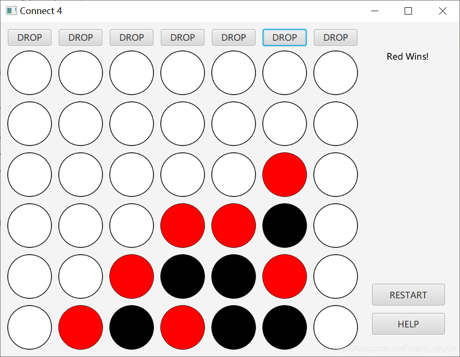

# Project5_COSC211

COSC 211 – MP5 (Paint Swings) - Due 03/29 – (50 points

Learning Objectives:
To practice using existing classes from the Java class library, calling methods, and object creation. In particular, you will make use of methods from the API of the Graphics class to draw a shape, and you will create one or more Color objects in order to add custom colors to your drawing. 

Programming Assignment:
Create a Java application (Simple Paint Program) that will have a menu (COLOR, SHAPE, FONT) and the user can sketch curves and shapes in a variety of colors on a variety of background colors. The user selects a drawing color from a menu at the top of the application. If the user clicks "Background", the background color is set to the current drawing color and the drawing area is filled with that color. If the user clicks "Clear", the drawing area is just filled with the current background color.

The user selects the shape to draw from another menu at the top of the application.  The user can draw one of six different types of shapes or enhance the text in the text box.

When the application starts, it will display a frame with a background color of cyan and a text box on the frame. 

If the user clicks the SHAPE menu, a submenu will appear with the following menu items: 
•	Straight Line, 
•	Rectangle, 
•	Oval, 
•	Round Rectangle, 
•	Filled Rectangle, 
•	Filled Oval. 

If the user clicks the COLOR menu, three submenus will appear with the following menu items:
1.	Foreground
•	Black
•	Blue
•	Cyan
•	Green
•	Magenta
•	Red
2.	Background
•	Black
•	Blue
•	Cyan
•	Green
•	Magenta
•	Red
3.	Clear

If the user clicks the FONT menu, two submenus will appear with the following menu items:
1.	Style
•	BOLD
•	ITALICS
2.	Size
•	SIZE 10
•	SIZE 20
•	SIZE 72

The program should use:
•	Arrays (for the images and the items)
•	Panels
•	Graphics
•	TextField
•	Menus (Figure, Color, Font)
•	Layout
•	Interfaces (implements ActionListener, MouseListener or MouseAdapter)
•	Inheritance (extends JPanel, extends JFrame)

After the user makes his choices from the menu, the user will use the mouse to draw the shape on the panel, the color will apply to the drawing. If the use enters a text in the text field, then the Font choices will apply to the text but not the shape.
The starting x coordinate is called startX, and the starting y coordinate is called startY. These variables are both currently set to 300, but you are welcome to assign them other values. Use these variables for all coordinates that you specify in your method calls. Doing so will allow you to easily move your drawing within the window by simply changing the values of startX and startY. 
To make your code readable, you must define and use variables for the numeric values that you will use to create your drawing. That is, whenever you make a method call using the Graphics object, you should employ variables as arguments, rather than numeric literals. For example, let's say that you are drawing a circle. Rather than specifying a value of 30 for the diameter of the circle, you should use a variable named something like shapeWidth that has been assigned the value 30. Define all of these variables at the top of your paint method, and give them meaningful names. 

You need to turn in the source code and screen shots of the output. No credit will be given if the program doesn’t compile successfully. The due date has to be met; otherwise the program will not be accepted.

Note: You should stick with Graphics methods that use programming elements we've discussed in class. Be creative -- and have fun! 

